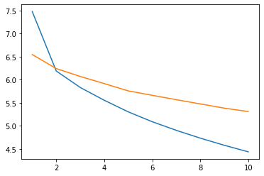
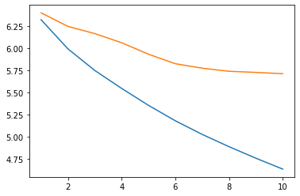
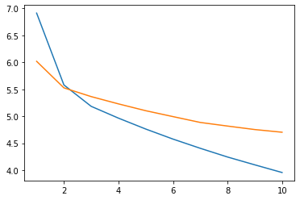
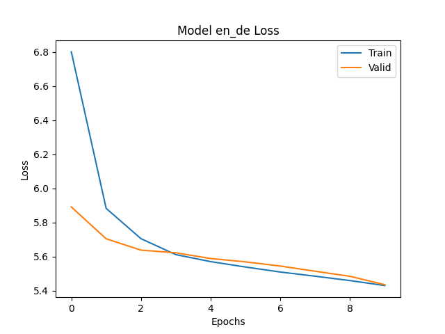
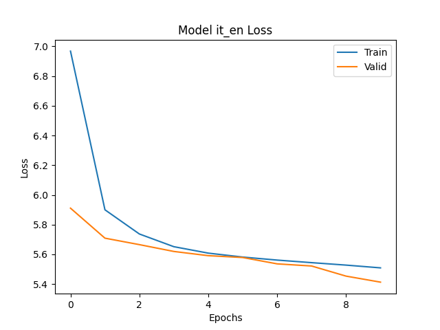

# coding-template

## Summary

The summary can contain but is not limited to:

- Code structure.

- Commands to reproduce your experiments.

- Write-up of your findings and conclusions.

- Ipython notebooks can be organized in `notebooks`.

## Reference

Any code that you borrow or other reference should be properly cited.

For the sequence to sequence paper by Sutskever et al, the code from the below 2 sources were used:

https://pytorch.org/tutorials/beginner/translation_transformer.html

https://github.com/bentrevett/pytorch-seq2seq/blob/master/1%20-%20Sequence%20to%20Sequence%20Learning%20with%20Neural%20Networks.ipynb


For the translation task we used the dataset IWSLT 2017 in torchtext and Multi30k.

https://pytorch.org/text/stable/datasets.html#iwslt2017

https://pytorch.org/text/stable/datasets.html#multi30k

For the Music task, we used the dataset


For the translation task, due to memory and hardware constraints, we use a subset of the IWSLT dataset. We use the first 25000 examples of the training, first 5000 of the validation and 5000 of the test dataset.

## Sequence to Sequence Learning using deep LSTM encoder decoder

English to German task


German to Italian task


Italian to English task


The LSTMs overfit to the first 25000 examples causing it to do worse in the validation and test dataset. When running on a smaller dataset such as WMT'14, we did not see this issue.

English to German task on WMT'14


## Gated Recurrent Neural Networks on Sequence Modeling

English to German task



German to Italian task



Italian to English task




## Neural Machine Translation by Jointly Learning to Align and Translate

After training each of the three models (en-de, de-it, it-en) with the tuned hyper-parameters, the following cross-entropy loss results were achieved on the test sets.
These losses show that the models were relatively consistent in loss performance.

English to German task



German to Italian task


Italian to English task



The Bleu scores were then calculated for each of the three models.
However these scores were very low, likely due to a long sentence size of 50 tokens allowed and limited computing power to train beyond 10 epochs on a small subset of the data, therefore the model makes innaccurate translations of the source sentences.


## Data Sources

For the IWSLT2017 datasets, refer to the [PyTorch tutorial](https://pytorch.org/tutorials/beginner/translation_transformer.html) for preprocessing code used in this repository. The IWSLT2017 dataset is from the paper [WIT3: Web Inventory of Transcribed and Translated Talks](https://aclanthology.org/2012.eamt-1.60.pdf). You can cite their work with:
```
@inproceedings{cettoloEtAl:EAMT2012,
    Address = {Trento, Italy},
    Author = {Mauro Cettolo and Christian Girardi and Marcello Federico},
    Booktitle = {Proceedings of the 16$^{th}$ Conference of the European Association for Machine Translation (EAMT)},
    Date = {28-30},
    Month = {May},
    Pages = {261--268},
    Title = {WIT$^3$: Web Inventory of Transcribed and Translated Talks},
    Year = {2012},
}
```
