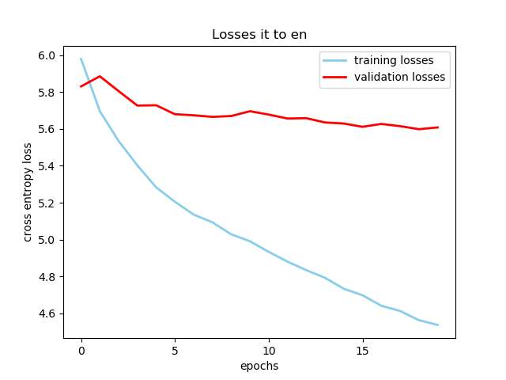
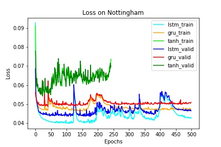
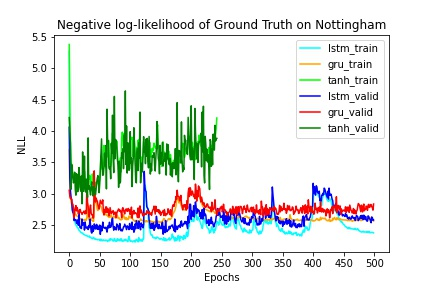
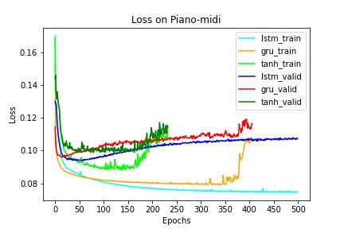
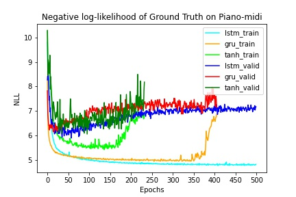
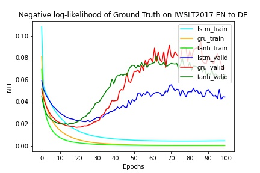
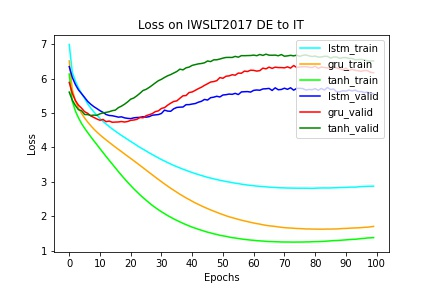
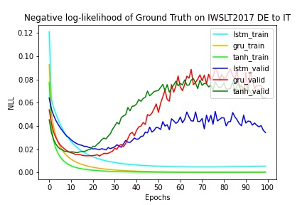
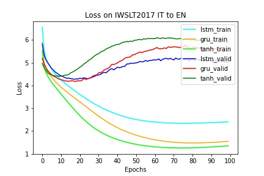

# Sequence Models - Week 6 Group 1

Our group covered the following sequence models and papers,

* LSTM: [Sequence to Sequence Learning with Neural Networks](https://arxiv.org/abs/1409.3215), Sutskever, Vinyals, Le; 2014
* GRU: [Empirical Evaluation of Gated Recurrent Neural Networks on Sequence Modeling](https://arxiv.org/abs/1412.3555), Chung, Gulcehre, Cho, Bengio; 2014
* LSTM with Attention: [Neural Machine Translation by Jointly Learning to Align and Translate](https://arxiv.org/abs/1409.0473), Bahdanau, Cho, Bengio; 2014
* Transformer: [Attention Is All You Need](https://arxiv.org/abs/1706.03762), Vaswani, Shazeer, Parmar, Uszkoreit, Jones, Gomez, Kaiser, Polosukhin; 2017

The code for each can be found in the following folders:
* LSTM: code in `src/sutskever`.
* GRU: code in `src/chung`, notebooks in `notebooks/chung`.
* LSTM with Attention: code in `src/RNNsearch`.
* Transformer: notebooks in `notebooks/vaswani`.

## Dataset
We used the IWSLT2017 translation dataset [2, 5]. Specifically, we measured the performance of our models on the English to German, German to Italian, and Italian to English datasets in the IWSLT2017 dataset. 

----
## Sequence to Sequence Learning using Deep LSTM Encoder-Decoder

### LSTM models

The model uses deep LSTMs with an encoder decoder architecture. The encoder maps the source sequence to a fixed space and the decoder sequence decodes it from the fixed sequence to the target language. We decode with the target length being known. So during inference time, we set teacher forcing ratio to 0. This results in the decoder running for the length of the target sentence.

### Training
For the translation task, due to memory and hardware constraints, we use a subset of the IWSLT dataset. We use the first 25000 examples of the training, first 5000 of the validation and 5000 of the test dataset. We run the training for 20 epochs with a learning rate of 0.001 for ADAM. The average cross entropy loss was calculated after each epoch for both training and validation data.

We train 3 different models for translation from en->de, de->it and it->en

### Results

The LSTMs overfit to the first 25000 examples causing it to do worse in the validation and test dataset. When running on a smaller dataset such as WMT'14, we did not see this issue. If given the full training set, it may have generalized better over each epoch and done well on the test and validation set.

English to German task

German to Italian task

Italian to English task

English to German task on Multi30k

Average BLEU score for each model trained on IWSLT

|`en_de` | `de_it` | `it_en` |
|---------|---------|---------|
| 0.23% | 0.14% | 0.31% |

----
## Attention is All You Need

English to German task

German to Italian task

Italian to English task

----
## Neural Machine Translation by Jointly Learning to Align and Translate

After training each of the three models (en-de, de-it, it-en) with the tuned hyper-parameters, the following cross-entropy loss results were achieved on the test sets.
These losses show that the models were relatively consistent in loss performance.

English to German task

German to Italian task

Italian to English task

The Bleu scores were then calculated for each of the three models.
However these scores were very low, likely due to a long sentence size of 50 tokens allowed and limited computing power to train beyond 10 epochs on a small subset of the data, therefore the model makes innaccurate translations of the source sentences.

----
## Comparing GRU, LSTM, and tanh RNNs on Music Modeling and Translation
Based on the paper [Empirical Evaluation of Gated Recurrent Neural Networks on Sequence Modeling](https://arxiv.org/abs/1412.3555), these experiments aim to:
* Create models of similar parameters.
* Train models using the similar hyperparameter settings.
* Evaluate the difference in performance between GRU, LSTM, and tanh RNNs on Music Modeling and Translation tasks.

### Task: Music Music Modeling
For this task, we aim to use RNNs to model a sequence of music. This is done by giving music notes played at a timestep as input and have the model predict the music notes played at the next timestep. In practice, the model takes in a sequence of notes to predict a sequence of the next notes.

### Task: Machine Translation
Given a source sentence in one language, translate it to another language. Our model does this in a sequence-to-sequence manner by encoding the source language with an encoder and decoding the target sequence with a decoder conditioned on the encoded representation.

### Datasets
For music modeling, we used the polyphonic music dataset [1] that is also used in the experiments in the paper. The datasets contain music from JSB Chorales, Nottingham, MuseData, and Piano-midi.de. Each timestep of the music piece is a vector of dimension 88, which indicates which of the 88 notes are played at that timestep. We got the data from the official TCN [3] repository [4].

In general, JSB Chorales contain short sequences of music, which is about 70 timesteps per piece. Nottingham contain medium-length sequences of music, which is about 200 timesteps per piece. MuseData and Piano-midi.de contain the longer sequences of music, which is about 1000 to 2000 timesteps per piece. Here's a Nottingham example:

For translation, we used the IWSLT2017 dataset [2], which contained reference texts of translating English to German (`en_de`), German to Italian (`de_it`), and Italian back to English (`it_en`). PyTorch implemented IWSLT2017 as a standard dataset in their `torchtext` package [5], which we used for our experiments.

### Model Details
Our models closely follow the standards described in the paper. The only difference between models is the number of hidden units used in the RNN. Here are the details of the music model sizes if given a sequence with 200 timesteps as input:

| RNN | Hidden Units | Parameters |
|-----|--------------|------------|
| LSTM | 38 | ~22.89K |
| GRU | 46 | ~22.90K |
| tanh | 100 | ~27.89K |

Similarly for the translation task, but inputting and predicting 50 tokens at max:

| RNN | Hidden Units | `en_de` | `de_it` | `it_en` |
|-----|--------------|---------|---------|---------|
| LSTM | 512 | ~18.31M | ~19.47M | ~18.50M |
| GRU | 587 | ~18.42M | ~19.64M | ~18.58M |
| tanh | 958 | ~19.35M | ~20.88M | ~19.33M |

The parameters vary for different dataset since each dataset has different vocabularies, which means different output dimensions due to the different number of tokens in the vocabulary.

**Music Modeling Hyperparameters**: We mostly follow the paper in hyperparameter settings. The models are trained with RMSProp with learning rate of 0.001 and momentum of 0.9. We used Binary Cross Entropy loss as the criterion. We did not use weight decay. The norm of the gradient is rescaled to 1 at every update. We train for 500 epochs as described in the paper and saved the models every 100 epochs.

**Translation Hyperparameters**: We stacked 2 layers of RNNs together for deeper representations. The models are trained with SGD with learning rate of 0.1 and momentum of 0.9. We used Cross Entropy loss as the criterion. We used weight decay of 0.0001 and gradient rescaling to 1. We train for 100 epochs and saved the models every 10 epochs. For inference, we used a beam size of 12.

It should be noted that the stop tokens (`<EOS_IDX>`) and unknown tokens (`<UNK_IDX>`) are super common in the dataset. So, we applied a weight of 0.1 for each on the Cross Entropy loss during training and that helped resolving early stopping and outputting unknown tokens often.

Note that due to time constraints, we only trained on the first 25K examples of the training set (out of 200K examples).

### Code Organization
* The code directory is `src/chung` and the notebook directory is `notebooks/chung`.
* The training code, model code, and dataset code can be found in `train.py`, `model.py`, and `utils.py`, respectfully.
* Example commands to reproduce our results can be found in the `src/chung/README.md`. Refer to `notebooks/chung/README.md` for the purpose of each notebook.

### Music Modeling Results
Following the paper, we use the negative log-likelihood (NLL) of the predicted music sequence as a metric for model performance. This is the negative log-likelihood per timestep (not per note), and we take the average negative log-likelihood of all timesteps as the metric for the model's performance over the dataset. Smaller NLL is better. Here's a table of the NLL taken after training each model for 100 epochs:

| Dataset | Dataset Split | tanh | GRU | LSTM |
|---------|---------------|------|-----|------|
| Notthingham | train | 3.4737 | 2.6263 | 2.2708 |
| | valid | 3.3997 | 2.7426 | 2.5266 |
| | test | 3.5345 | 2.7628 | **2.5464** |
| JSB Chorales | train | 5.6582 | 4.6874 | 4.1984 |
| | valid | 6.2460 | 6.1866 | 6.4905 |
| | test | 6.3928 | **6.2018** | 6.4827 |
| MuseData | train | NaN | 5.1844 | 4.9121 |
| | valid | NaN | 5.6420 | 5.1642 |
| | test | NaN | 5.9195 | **5.192** |
| Piano-midi.de | train | 5.5251 | 5.0361 | 4.9867 |
| | valid | 6.4411 | 6.9819 | 6.4961 |
| | test | **5.7588** | 6.0350 | 5.8658 |
| All Datasets Combined | train | NaN | 4.6592 | 4.3599 |
| | valid | NaN | 4.8810 | 4.5163 |
| | test | NaN | 4.9007 | **4.4937** |

Contrary to the paper, we found **LSTM to outperform GRU on most datasets**. We found the models to also overfit quite quickly during training. The models converged quite early in the 20 to 30 epochs. Thus, if we measured the NLL for the test set for models trained with just 30 epochs instead of 100 epochs, we may see a difference in results. The following loss and NLL plots show the quick overfitting:

| JSB Chorales | |
|-|-|
|  |  |

| MuseData | |
|-|-|
|  |  |

| Nottingham | |
|-|-|
|  |  |

| Piano-midi | |
|-|-|
|  |  |

The darker colors are the validation plots while the lighter colors are the training plots. Since we found LSTM to reach smaller NLLs on all datasets, we believe that the best LSTM model will likely have the smallest NLLs compared to the other models on the test sets as well.

Even with gradient rescaling and clipping to norm 1, we found that all models were still prone to getting exploding gradients when the sequences are way too long. This is especially the case for Tanh RNNs, which got NaN weights after training for too long. We also found Tanh RNNs to overfit faster than LSTM and GRU RNNs.

Here's some visualization of the models outputs on the JSB validation set during training for the first 80 epochs:

<table>
    <colgroup>
        <col style="height: 50%"/>
        <col style="height: 50%"/>
    </colgroup>
    <thead>
        <tr>
            <th colspan="1">Gold</th>
            <th colspan="1">tanh</th>
        </tr>
    </thead>
    <tbody>
        <tr>
            <td></td>
            <td></td>
        </tr>
    </tbody>
    <thead>
        <tr>
            <th colspan="1">LSTM</th>
            <th colspan="1">GRU</th>
        </tr>
    </thead>
    <tbody>
        <tr>
            <td></td>
            <td></td>
        </tr>
    </tbody>
</table>

It seems that the tanh RNN have the most trouble learning the music. GRU learned the repeated chord structure of the music somewhat but can't learn the melodies (less as extended notes, constantly changing notes). LSTM learned the repeated chord structure of the music somewhat and some parts of the melodies. The same observations are typically found in training on the other datasets as well.

For more visualizations, please refer to the notebook `notebooks/chung/training_visualizations.ipynb`.

### Machine Translation Results
We report the [BLEU score](https://en.wikipedia.org/wiki/BLEU), BiLingual Evaluation Understudy, as a performance metric for our model's translation. BLEU score compares a translated sentence to a list of reference translations and returns a score based on how well the translated sentence match. Here's a table of the BLEU scores after training for 10 epochs:

| Dataset | Dataset Split | tanh | GRU | LSTM |
|---------|---------------|------|-----|------|
| IWSLT2017 English to German | valid | 2.1328 | 1.9314 | 2.0782 |
| | test | **2.5734** | 2.1895 | 2.2425 |
| IWSLT2017 German to Italian | valid | 1.0930 | 0.9610 | 0.9584 |
| | test | **1.2864** | 1.0731 | 0.8819 |
| IWSLT2017 Italian to English | valid | 2.2937 | 1.9187 | 1.6754 |
| | test | 2.3136 | **2.3142** | 1.6200 |

Here's a table of the BLEU scores for each model's best run (measured by BLEU on validation):

| Dataset | Dataset Split | tanh (20 Epochs) | GRU (50 Epochs) | LSTM (50 Epochs) |
|---------|---------------|------|-----|------|
| IWSLT2017 English to German | valid | 2.0738 | 2.8008 | 3.4278 |
| | test | 2.7618 | 3.6364 | **4.3379** |
| IWSLT2017 German to Italian | valid | 1.4667 | 1.6683 | 1.5129 |
| | test | 1.1716 | 1.5171 | **1.6302** |
| IWSLT2017 Italian to English | valid | 2.8931 | 3.4902 | 3.3751 |
| | test | 2.8606 | **3.3979** | 3.3768 |

We found that tanh RNN trained faster than GRU and LSTM for the first few epochs, which explains its performance in the first table. Since we only used the first 25K examples in the training set for training, overfitting heavily ensued. This is reflected both in BLEU scores and the following loss and NLL plots:

| English to German | |
|-|-|
|  |  |

| German to Italian | |
|-|-|
|  |  |

| Italian to English | |
|-|-|
|  |  |

Overall, LSTM performed the best in translation. For some datasets, GRU and LSTM performed comparably. All models seem to have converged around 20 epochs, but there are improvements in the BLEU scores by overfitting somewhat after convergence.

According to the visualizations shown in `notebooks/chung/training_visualizations.ipynb`, the models are best at translating common words such as 'the' and 'and'. Arbitrary translation inference can be found at `notebooks/chung/translation_inference.ipynb`.

### Conclusion
We generally found LSTM to outperform all the other models for all tasks. GRU and LSTM seemed to perform comparably on certain datasets. Visualizations show that the models usually learned the most common and repeated part of the sequences.

----
## References
[1] Boulanger-Lewandowski et al. [Modeling Temporal Dependencies in High-Dimensional Sequences: Application to Polyphonic Music Generation and Transcription](http://www-ens.iro.umontreal.ca/~boulanni/icml2012).

[2] Cettolo et al. [WIT3: Web Inventory of Transcribed and Translated Talks](https://aclanthology.org/2012.eamt-1.60.pdf).

[3] Bai et al. [An Empirical Evaluation of Generic Convolutional and Recurrent Networks for Sequence Modeling](https://arxiv.org/abs/1803.01271).

[4] Polyphonic Music Datasets from TCN Repository: https://github.com/locuslab/TCN/tree/master/TCN/poly_music

[5] PyTorch implementation of IWSLT2017 dataset: https://pytorch.org/text/stable/datasets.html#iwslt2017

## More Reference Information
For the sequence to sequence paper by Sutskever et al, the code from the below 2 sources were used:

https://pytorch.org/tutorials/beginner/translation_transformer.html

https://github.com/bentrevett/pytorch-seq2seq/blob/master/1%20-%20Sequence%20to%20Sequence%20Learning%20with%20Neural%20Networks.ipynb

For the implementation of Bahdanau, Cho, and Bengio's [paper](https://arxiv.org/pdf/1409.0473v7.pdf) the code was adapted from Austin Jacobson's neural machine translation network linked [here](https://github.com/A-Jacobson/minimal-nmt)

For the translation task we used the dataset IWSLT 2017 in torchtext and Multi30k.

https://pytorch.org/text/stable/datasets.html#iwslt2017

https://pytorch.org/text/stable/datasets.html#multi30k

For the translation task, due to memory and hardware constraints, we use a subset of the IWSLT dataset. We use the first 25000 examples of the training, first 5000 of the validation and 5000 of the test dataset.

