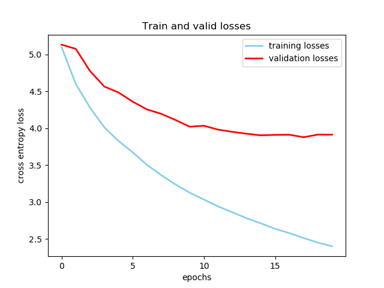

# coding-template

## Summary

The summary can contain but is not limited to:

- Code structure.

- Commands to reproduce your experiments.

- Write-up of your findings and conclusions.

- Ipython notebooks can be organized in `notebooks`.

## Reference

Any code that you borrow or other reference should be properly cited.

For the sequence to sequence paper by Sutskever et al, the code was adapted from the [pytorch tutorials](https://pytorch.org/tutorials/beginner/translation_transformer.html) and [Ben Trevett's implementation](https://github.com/bentrevett/pytorch-seq2seq/blob/master/1%20-%20Sequence%20to%20Sequence%20Learning%20with%20Neural%20Networks.ipynb)

For the translation task we used the dataset [IWSLT 2017](https://pytorch.org/text/stable/datasets.html#iwslt2017) in torchtext and [Multi30k](https://pytorch.org/text/stable/datasets.html#multi30k).

## Sequence to Sequence Learning using deep LSTM encoder decoder

## LSTM models

The model uses deep LSTMs with an encoder decoder architecture. The encoder maps the source sequence to a fixed space and the decoder sequence decodes it from the fixed sequence to the target language. We decode with the target length being known. So during inference time, we set teacher forcing ratio to 0. This results in the decoder running for the length of the target sentence.

## Training
For the translation task, due to memory and hardware constraints, we use a subset of the IWSLT dataset. We use the first 25000 examples of the training, first 5000 of the validation and 5000 of the test dataset. We run the training for 20 epochs with a learning rate of 0.001 for ADAM. The average cross entropy loss was calculated after each epoch for both training and validation data.

We train 3 different models for translation from en->de, de->it and it->en

## Results

The LSTMs overfit to the first 25000 examples causing it to do worse in the validation and test dataset. When running on a smaller dataset such as WMT'14, we did not see this issue. If given the full training set, it may have generalized better over each epoch and done well on the test and validation set.

English to German task

German to Italian task

Italian to English task

Average BLEU score for each model

English to German task on WMT'14

